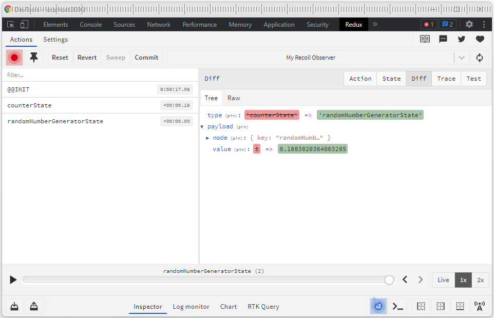

<!-- markdownlint-configure-file {
  "MD013": {
    "code_blocks": false,
    "tables": false
  },
  "MD033": false,
  "MD041": false
} -->

<div align="center">

# recoil-observer

Recoil Observer through Redux DevTools

</div>

## Installation

```sh 
yarn add @theohagos/recoil-observer
```

or

```sh 
npm install @theohagos/recoil-observer
```

## Usage

```jsx
import App from './App.tsx';
import { RecoilRoot } from 'recoil';
import { RecoilObserver } from '@theohagos/recoil-observer';

<RecoilRoot>
    <RecoilObserver />
    <App />
</RecoilRoot>
```

## API

| props          | description                            | default value | type    |
| -------------- | -------------------------------------- | ------------- | ------- |
| exclude           | List of recoil keys to exclude from Redux Devtool | []          | string[] |
| name           | The name that will appear on Redux Devtool | Recoil State Observer          | string |
| maxAge            | Redux Devtool prop              | 100          | number |
| trace    | Redux Devtool prop     | false         | boolean |


## Redux Devtool View
Open up redux devtools and observe state changes in redux devtools, replay recoil state as well as time-travel



